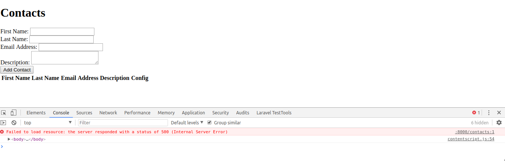

# Backbone JS / Laravel Setup - tutsplus

 

	Aula com Atul Zalavadiya
    

- webdesigning-art.blogspot.in/

## About Laravel

Laravel is a web application framework with expressive, elegant syntax. We believe development must be an enjoyable and creative experience to be truly fulfilling. Laravel attempts to take the pain out of development by easing common tasks used in the majority of web projects, such as:

- Aula no video em andamento n.28
- https://www.youtube.com/watch?v=y-TH67x4JXE&index=3&list=PL8UMCSZG3BBTCBy-2bakj9df_xe6HSPEN

### Renato Lucena - Date = 05/07/2018.